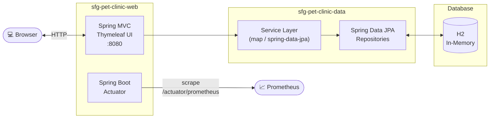
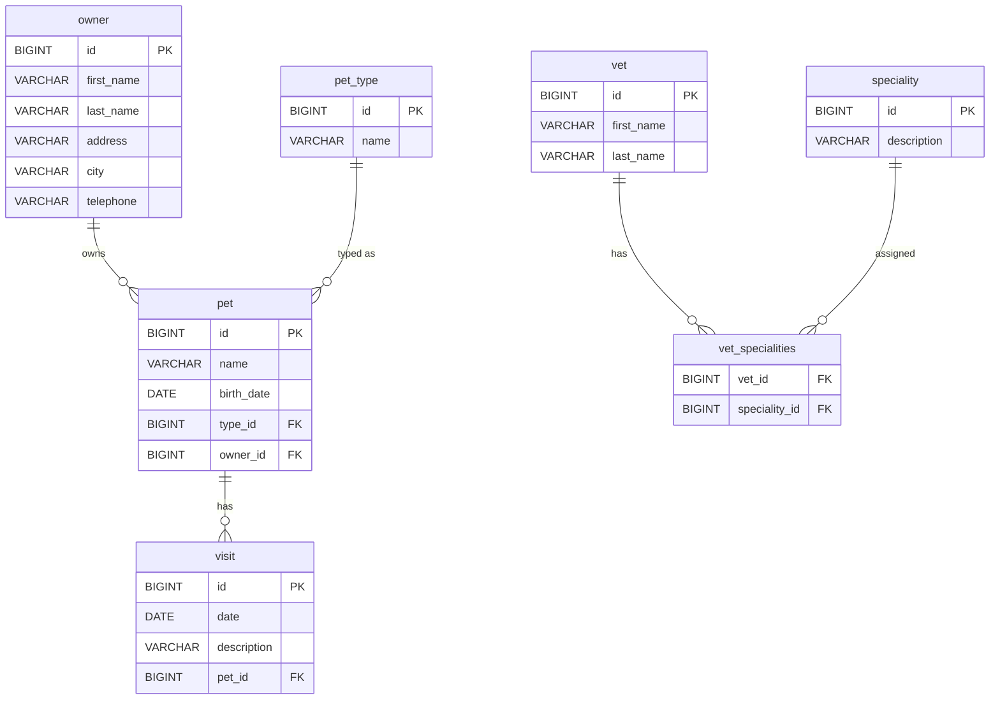

# sfg-pet-clinic

## Abstract

This project is a modern implementation of the classic Spring Pet Clinic application, developed using Spring Boot 4 and Java 25. It demonstrates best practices in Java development and cloud-native deployments. The application is built with a modular multi-module architecture, utilizing Spring Data JPA for data persistence, Spring MVC for the web interface, and Lombok for reducing boilerplate code.

Key Features:
- Full Docker container support
- Kubernetes deployment with Helm charts
- Integrated monitoring through Spring Boot Actuator
- Modern web interface using Bootstrap 5
- CI/CD pipeline via GitHub Actions
- Modular structure separating data and web components

## Architecture Overview



## Domain Model



## Access

GUI: http://localhost:8080/ or http://localhost:30080

Based on: https://github.com/spring-projects/spring-petclinic.git

## Sandbox (local dev environment)

The sandbox is provisioned by the [opencode-sandbox-kit](https://github.com/dboeckli/opencode-sandbox-kit)
and runs as a Docker container (MicroVM). It mounts this repo, starts the agent, and connects the
IntelliJ MCP server.

### Start the sandbox (OpenCode)

```powershell
sbx run opencode `
    --kit "git+https://github.com/dboeckli/opencode-sandbox-kit.git#dir=opencode-agent" `
    --template docker/sandbox-templates:opencode-docker-0.5.0 `
    --no-share-skills `
    --static-mcp idea `
    . `
    "$env:USERPROFILE\.kube:ro" `
    "C:\development\maven-repo:ro"
```

Claude Code:

```powershell
sbx run claude `
    --kit "git+https://github.com/dboeckli/opencode-sandbox-kit.git#dir=opencode-agent" `
    --template docker/sandbox-templates:claude-code-docker-0.5.0 `
    --no-share-skills `
    --static-mcp idea `
    . `
    "$env:USERPROFILE\.kube:ro" `
    "C:\development\maven-repo:ro"
```

Mammouth Code:

```powershell
sbx run "git+https://github.com/dboeckli/opencode-sandbox-kit.git#dir=mammouth-agent" `
    --no-share-skills `
    --static-mcp idea `
    . `
    "$env:USERPROFILE\.kube:ro" `
    "C:\development\maven-repo:ro"
```

- `"$env:USERPROFILE\.kube:ro"` — optional Kubernetes support (kubectl/helm in the Docker Desktop cluster)
- `"C:\development\maven-repo:ro"` — read-only host Maven cache (avoids re-downloading cached dependencies)

### Sandbox quirk

The sandbox mounts the repo via filesystem passthrough, which blocks symlinks — Spotless's
`npm install` (prettier) fails with `EPERM` unless npm skips bin links. The kit sets
`npm_config_bin_links=false` globally, so no manual export is needed inside the kit sandbox. On a
normal host (Windows/CI) this does not apply.

## Deployment with Helm

Be aware that we are using a different namespace here (not default).

Go to the directory where the tgz file has been created after 'mvn install'

```powershell
cd sfg-pet-clinic-web/target/helm/repo
```

unpack

```powershell
$file = Get-ChildItem -Filter sfg-pet-clinic-web-chart-*.tgz | Select-Object -First 1
tar -xvf $file.Name
```

install

```powershell
$APPLICATION_NAME = Get-ChildItem -Directory | Where-Object { $_.LastWriteTime -ge $file.LastWriteTime } | Select-Object -ExpandProperty Name
helm upgrade --install $APPLICATION_NAME ./$APPLICATION_NAME --namespace sfg-pet-clinic-web --create-namespace --wait --timeout 5m --debug --render-subchart-notes
```

show logs and show event

```powershell
kubectl get pods -n sfg-pet-clinic-web
```

replace $POD with pods from the command above

```powershell
kubectl logs $POD -n sfg-pet-clinic-web --all-containers
```

Show Details and Event

$POD_NAME can be: sfg-pet-clinic-web

```powershell
kubectl describe pod $POD_NAME -n sfg-pet-clinic-web
```

Show Endpoints

```powershell
kubectl get endpoints -n sfg-pet-clinic-web
```

status

```powershell
helm status $APPLICATION_NAME --namespace sfg-pet-clinic-web
```

test

```powershell
helm test $APPLICATION_NAME --namespace sfg-pet-clinic-web --logs
```

uninstall

```powershell
helm uninstall $APPLICATION_NAME --namespace sfg-pet-clinic-web
```

delete all

```powershell
kubectl delete all --all -n sfg-pet-clinic-web
```

create busybox sidecar

```powershell
kubectl run busybox-test --rm -it --image=busybox:1.36 --namespace=sfg-pet-clinic-web --command -- sh
```

You can use the actuator rest call to verify via port 30080

## Docker

### create image

```shell
.\mvnw clean package spring-boot:build-image
```

or just run

```shell
.\mvnw clean install
```

